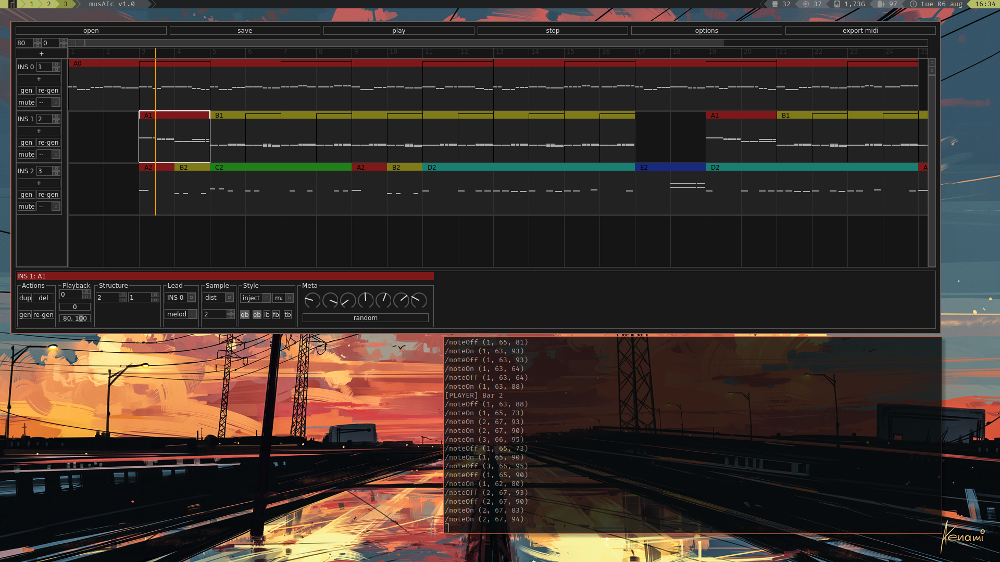

# musAIc
Interface for composing music with an A.I. musician



Currently in active development.

## Basic Installation

### Requirements

It is recomended to use Python version 3.6.x since I have encountered issues with installing `tensorflow` and `keras` on later versions of Python. The best way of making this easy is to use isolated environments, such as with [pyenv](https://github.com/pyenv/pyenv).

### Linux / Mac

1. `$ git clone` this repository to somewhere in your home directory

2. Make sure you are in a Python 3.6.x environement (e.g. with global `$ python3 -v` is 3.6.x, or with something like [pyenv](https://github.com/pyenv/pyenv))

3. Install the required packages with ```$ pip install -r requirements/base.txt``` 

4. Launch `musAIc` with ```$ python src/main/python/main.py```


### Windows

1. Install `git` from [here](https://git-scm.com/downloads)

2. Make sure Python 3.6.8 installed and added to PATH (get the installer [here](https://www.python.org/downloads/release/python-368/))

3. Open Windows PowerShell (right-click Start button and select from the menu, or search `powershell.exe`) and `cd` to which directory will host `musAIc`

4. `$ git clone` this repository in some folder.

3. Install the required packages with ```$ pip install -r requirements/base.txt``` 

4. Launch `musAIc` with ```$ python src/main/python/main.py```

## Detailed Instructions
For complete beginners of Python and Terminal

### Mac

1. Open Terminal from the Finder.

2. Install XCode, Homebrew and Python 3.X. A simple guide that covers these can be found
   [here](https://installpython3.com/mac/). Follow the steps up untill the
   Virtual Environments stuff (I recommend something easier in the next step)
   
3. Install [pyenv](https://github.com/pyenv/pyenv):

   ```
   $ brew install pyenv openssl readline sqlite3 xz zlib
   $ echo -e 'if command -v pyenv 1>/dev/null 2>&1; then\n  eval "$(pyenv init -)"\nfi' >> ~/.bash_profile
   ```

   Restart the Terminal.

3. Create a folder and navigate into where you would like to install musAIc
   (this is done with the commands `$ mkdir DirectoryName/` to make directories and `$ cd
   path/to/directory` to move into a directory). This could be in somewhere like
   Projects/, Music/Tools/, or whatever you like to do to organise your projects.
   
4. Download (clone) this repository in this folder with the command, and move
   into the folder:

   ```
   $ git clone https://github.com/al165/musaic.git
   $ cd musaic
   ```
   
5. Create virtual environment and install dependencies:

   ```
   $ pyenv install 3.6.8
   $ pyenv local 3.6.8
   ```

   (Verify that the command `$ pyenv which python` returns some path with with
   `3.6.8` somewhere in it)
   
6. Finally, launch musAIc with the command `$ python src/main/python/main.py`

7. **Bonus**: to make it easier to start musAIc without using the terminal,
   first copy the output of the command `$ pwd` in the directory you launched
   musAIc from. Then, create a new file with your favourite text editor called
   `musaic.sh` and put in the following with the path you just copied:

   ```
   #!/bin/bash
   
   cd PATH_YOU_JUST_COPIED
   python src/main/python/main.py &
   ```

   Save this file to Desktop, then in Terminal run the command:

   ```
   $ sudo chmod +x ~/Desktop/musaic.py
   ```

   (If you are promted to enter your password, do so and press enter)

   Now, to launch musAIc just double click `musaic.sh`!


## Usage

**Work In Progress** 

### Using MIDI out

1. Make sure whichever MIDI device you wish to use (either through a soundcard, USB or a virtual MIDI cable) is initialised and working _before_ starting `musAIc`

2. Once started click `options`, tick the box next to MIDI, then select you MIDI device from the dropdown menu. Optionally you can send the MIDI clock signal too (on by default), however this is largely untested may act weird.

Note: there is also a small bug where re-opening the options dialog will reset which MIDI device it will use, so make sure to select the desired one again.


### Changing the AI musician

`musAIc` is currently bundelled with two neural networks: the original developed in 2019 (affectionately named `VERSION 9`), and the WIP pop star `EUROAI`. In the future they (and others!) would be selectable from within the GUI, however for now the only way is to change the `PLAYER` global variable in `src/main/python/network.py` to either 1 for `VERSION_9`, 2 for `EUROAI`, or 0 for a random number generator (for development/debugging, will not load `tensorflow`).


